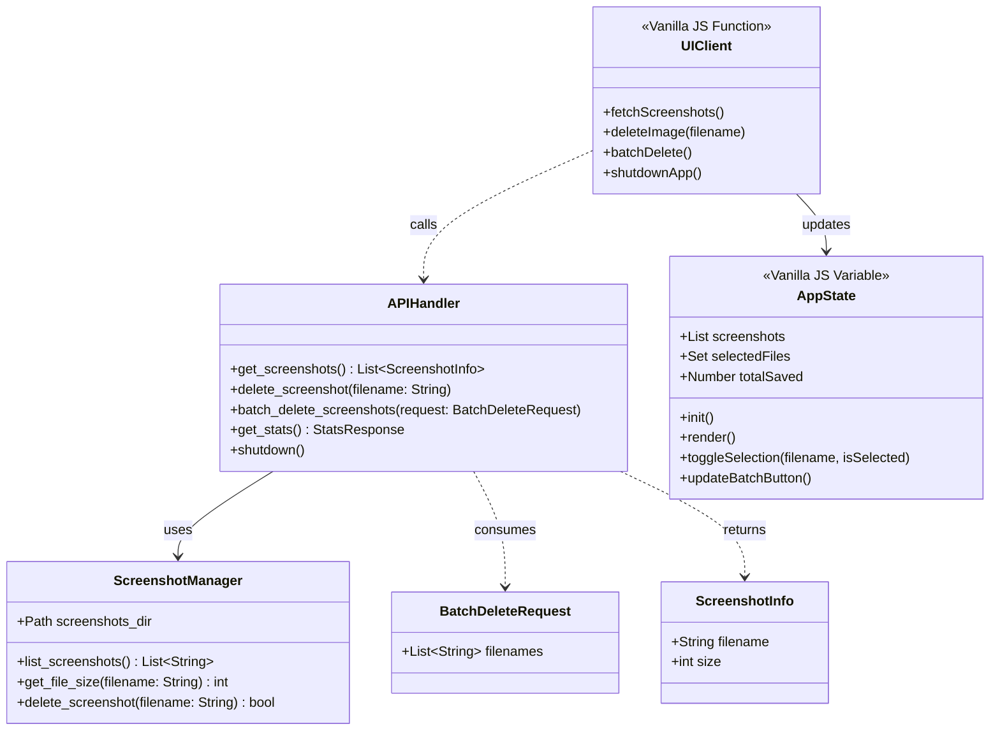

# Screenshot Cleaner Class Diagram

이 다이어그램은 Screenshot Cleaner 앱의 백엔드와 프런트엔드 구조를 시각화합니다.

## 주요 클래스 설명
- **ScreenshotManager (Backend)**: 실제 파일 시스템과 통신하여 파일 목록을 가져오거나 물리적인 삭제를 담당합니다.
- **APIHandler (Backend)**: FastAPI 서버로서 프런트엔드의 요청을 처리하고, 서버 종료(shutdown) 및 일괄 삭제와 같은 명령을 효율적으로 수행합니다.
- **BatchDeleteRequest (Model)**: 일괄 삭제 요청 시 사용되는 데이터 구조입니다.
- **AppState (Frontend)**: Vanilla JS 변수와 함수를 통해 현재 화면의 스크린샷 목록, 선택된 파일들, 그리고 누적 절약 용량을 관리합니다.
- **UIClient (Frontend)**: 백엔드 API와의 통신(Fetch API)을 담당하며, 응답에 따라 화면을 갱신하거나 앱을 종료합니다.
