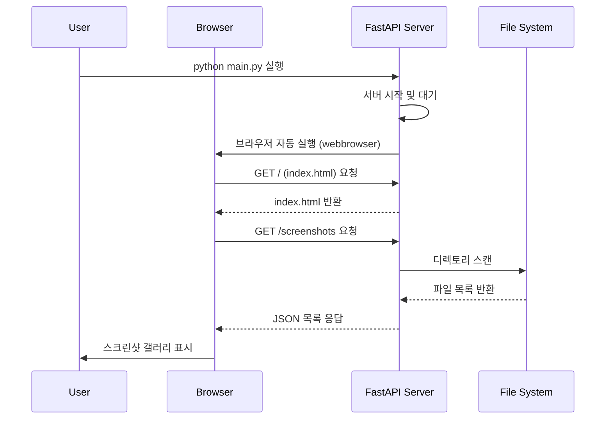
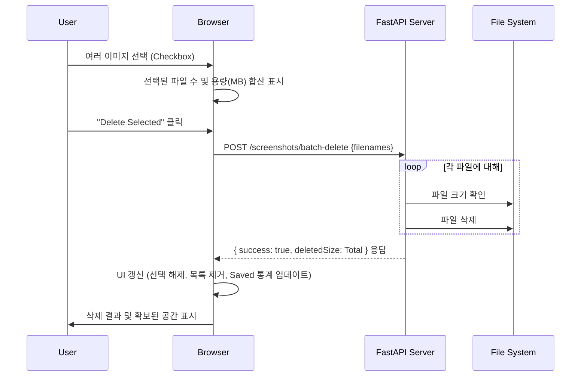
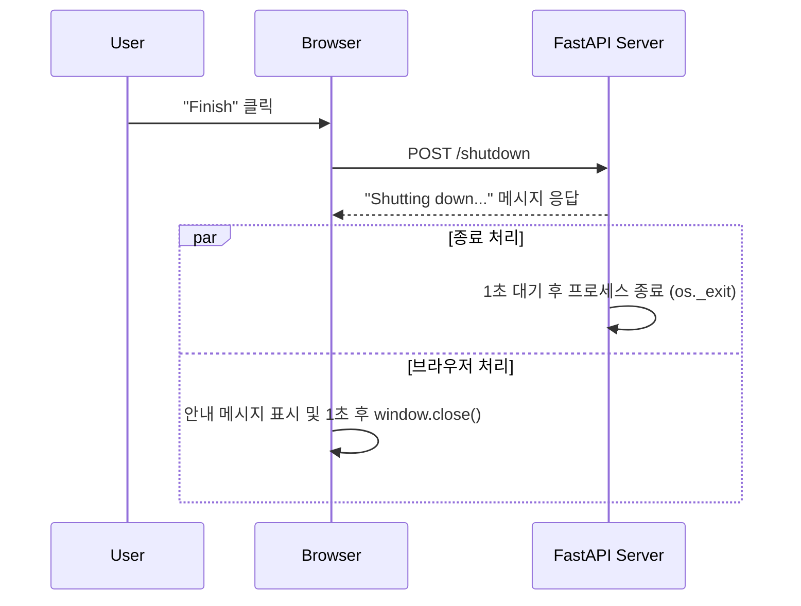

# Screenshot Cleaner Sequence Diagram

이 다이어그램은 사용자가 스크린샷을 확인, 일괄 삭제 및 앱을 종료할 때 발생하는 상호작용 흐름을 순차적으로 보여줍니다.

## 1. 초기 로딩 및 자동 실행 흐름

```mermaid
sequenceDiagram
    participant User
    participant Browser
    participant Backend as FastAPI Server
    participant FS as File System

    User->>Backend: python main.py 실행
    Backend->>Backend: 서버 시작 및 대기
    Backend->>Browser: 브라우저 자동 실행 (webbrowser)
    Browser->>Backend: GET / (index.html) 요청
    Backend-->>Browser: index.html 반환
    Browser->>Backend: GET /screenshots 요청
    Backend->>FS: 디렉토리 스캔
    FS-->>Backend: 파일 목록 반환
    Backend-->>Browser: JSON 목록 응답
    Browser->>User: 스크린샷 갤러리 표시
```

## 2. 일괄 삭제 (Batch Delete) 흐름

```mermaid
sequenceDiagram
    participant User
    participant Browser
    participant Backend as FastAPI Server
    participant FS as File System

    User->>Browser: 여러 이미지 선택 (Checkbox)
    Browser->>Browser: 선택된 파일 수 및 용량(MB) 합산 표시
    User->>Browser: "Delete Selected" 클릭
    Browser->>Backend: POST /screenshots/batch-delete {filenames}
    loop 각 파일에 대해
        Backend->>FS: 파일 크기 확인
        Backend->>FS: 파일 삭제
    end
    Backend-->>Browser: { success: true, deletedSize: Total } 응답
    Browser->>Browser: UI 갱신 (선택 해제, 목록 제거, Saved 통계 업데이트)
    Browser->>User: 삭제 결과 및 확보된 공간 표시
```

## 3. 앱 종료 (Shutdown) 흐름

```mermaid
sequenceDiagram
    participant User
    participant Browser
    participant Backend as FastAPI Server

    User->>Browser: "Finish" 클릭
    Browser->>Backend: POST /shutdown
    Backend-->>Browser: "Shutting down..." 메시지 응답
    par 종료 처리
        Backend->>Backend: 1초 대기 후 프로세스 종료 (os._exit)
    and 브라우저 처리
        Browser->>Browser: 안내 메시지 표시 및 1초 후 window.close()
    end
```
